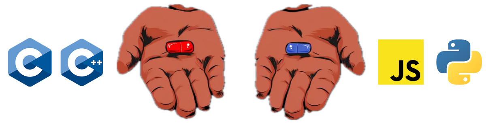
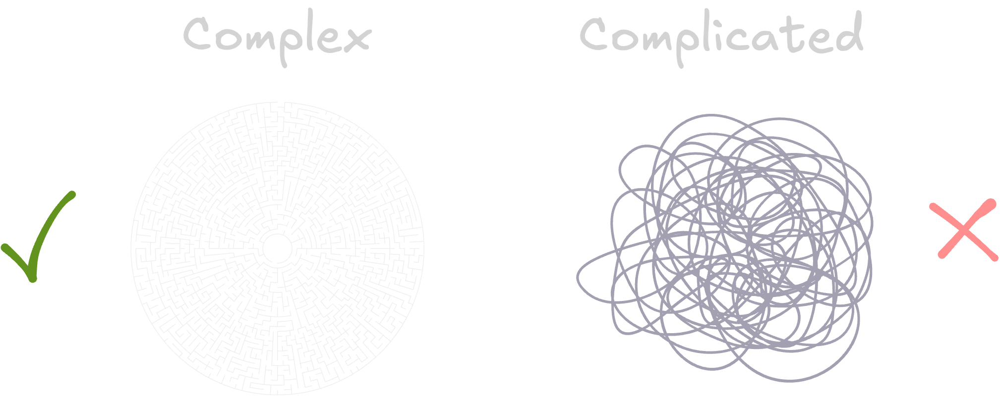
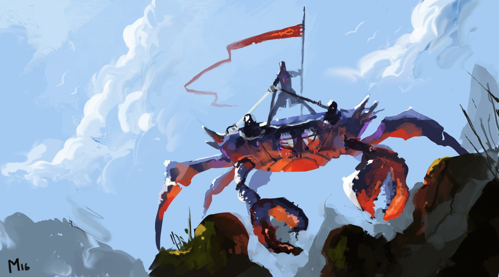

+++
title = "なぜRustなのか？"
date = "2025-09-19"
in_search_index = true
description="なぜ私が最初のプログラミング言語としてRustを選んだのか、そしてあなたもそれを検討したい理由。"
[taxonomies]
tags = ["roland", "rust", "learning"]
[extra]
og_image="crab-sword.jpg"
+++

**要約：** Rustを選んだのは意図的な選択の結果であり、後悔していません。厳しいが優秀な指導者であり、そうでなければ得られなかったよりもはるかに良い基盤を提供してくれました。

<!-- more -->

# 始めるのに最適なプログラミング言語は何か？

これは志望するソフトウェアエンジニアによって最もよく聞かれる質問の一つです。
これには多くの良い理由と、それほど良くない理由があります。
これは定義上、初心者が判断する準備ができていない選択です。
ある言語を別の言語より選ぶ理由はたくさんあります。
最も学びやすいもの、最も需要の高いもの、特定の関心領域に最も適切な言語など、何を探しているのでしょうか。

長い話を短くすると、一般的な合意は2つの方向のいずれかに向かいます：

## 深さとシンプルさ、どちらを望みますか？

一方で、Cはこの千年紀で合理的に行ける限り低レベルなプログラミング言語です。
Cでは、コンピューターの仕組みについてすべて学び、確実な基盤を築くことができます。
Cはあらゆる場所で、あらゆるものに使われています。50年以上にわたってそうなっています。
C（そして議論の余地はありますがC++）から始めることは、世界中の正式なコンピューターサイエンスカリキュラムと大学が好む道です。
CとC++はオリジナルであり、[優れたリソース](https://github.com/iczelia/C-Learning-Resources "C学習リソース")がたくさんあります。

一方で、高レベルチームがあります。
Pythonの構文は_英語のように読め_、JavaScriptは_事実上のウェブ標準_です。
どちらも、その後どこでも使うプログラミングの基本要素を教えてくれます。
望むと望まざるとにかかわらず、これらを避けることはできません。
ほとんどの独学ソフトウェアエンジニアは、どちらか一方から始めます。
[Python](https://wiki.python.org/moin/BeginnersGuide/Programmers "Python学習リソース")と[JavaScript](https://www.learn-js.org/ "JavaScript学習リソース")の両方を学ぶためのリソースも豊富にあります。本、コース、ゲーム、アプリ、ブートキャンプ、リストは無限です。

オンラインでこれらのアドバイスを見つけるのに、それほど時間はかかりませんでした。

## しかし、それほど単純ではありませんよね？

CとC++を一緒くたにしたことで、私に怒る人もいるでしょうが、CとC++の参入障壁は本当に高いです。
どちらも非常に混乱したエコシステム、コンパイラー、標準、バリエーション、フレーバーを持っており、これらから始めることは困難な作業です。
C++はまた、段階的で時には矛盾する「改善」の歴史と、そのエコシステムの豊富さに苦しんでおり、選択麻痺を引き起こします。

Pythonはシンプルですが、おそらくシンプルすぎて、直感的な構文の下に複雑さを隠しています。
素晴らしい[uv](https://docs.astral.sh/uv/ "uvドキュメント")が登場するまで、Pythonのパッケージと環境管理は信頼性がなく、摩擦に満ちていました。
そしてPythonは遅いです。
機械学習と人工知能におけるその広い採用と遍在性は、正直に言うと、私を少し誘惑しましたが、最終的には私が探していたものではありませんでした。

JavaScriptについては、言うことがたくさんあります。良いこともありますが、ほとんどはそれほど良くありません。
元々意図されていた範囲を超えてその範囲を拡張するために行われた作業には多くの敬意を持っています。
しかし、私には一貫性のない、過度に使用された言語のように見えました。私たち全員がいつか**学ばなければならない**ものですが、限られた自由時間を費やして学びたいものではありませんでした。

正直に言うと、その最後の議論が、おそらく最初の言語の選択に最も影響を与えました。
プログラミングを学ぶことは、私が**やりたい**ことでした。そして上記のどれも、必要な動機を提供するのに十分に刺激的には感じられませんでした。

## では、なぜRustなのか？

これはStack Overflow開発者調査で最も賞賛されている言語であり、ほぼ10年間にわたってそうなっています。良い理由があります。
Rustは[一から設計されました](https://youtu.be/k_-6KI3m31M?si=_aI_yIPFNzM1y5k_&t=1215 "Raph LevienによるHow Rust Won")50年以上のコンピューターサイエンス研究を活用し、組み合わせ、構築するために。
Rustは素晴らしいパフォーマンス、最先端の統一されたツールとパッケージ管理を持っています。
組み込みシステムからシステムプログラミング、幅広い分野のツールまで、_低レベルプログラミング_の世界を徐々に乗っ取っています。
これを書いている時点では、フロントエンド開発の第一選択肢ではありませんが、様々な理由でそうなることはないかもしれませんが、確実に_できる_ことはできます。
Rustは全体的に非常にうまく設計されたソフトウェアで、そのエンジニアリングについて否定的なことを言うのは本当に困難です。

Rustは私が最初の言語に探していたすべての機能を満たしています：

- **高速**です
- 低レベルと高レベルの両方のプログラミングが可能です
- 過去の教訓に基づいて構築されています
- **優れたエコシステムとツール**を持っています
- 幅広く**成長している採用**があります
- **悪い習慣を教えません**
- 私や他の人にとって[刺激的](https://youtube.com/playlist?list=PLZaoyhMXgBzoM9bfb5pyUOT3zjnaDdSEP&si=zo3MONviW91e9HX5 "RustのNo Boilerplateプレイリスト")です（[カルトではありません](/img/rust-cult.webp)）

したがって、Rustを選ぶ唯一の注意点は、学習が困難であるという評判です。
しかし、それは私にとってそれほど問題ではありませんでしたし、あなたにとってもそうでないかもしれません。
困難さが問題であることはめったになく、より頻繁には、この困難さが明確さの欠如と不要な複雑さを通じて表現されることです。
話すこと、歩くこと、数えること、社会的に交流することは困難です。
サッカー、体操、ダンス、絵を描くことは困難です。
書くこと、読むこと、コンピューターを使うことは困難です。
私たちは困難なことをすることができます。

> 困難なことをするのは簡単ではありませんが、価値があります。
>
> ~ ミア・ラブ

したがって、質問は**「困難ですか？」**から、はるかに興味深いものに変わります：「なぜ**この特定の困難**を選ぶのか」。

ソフトウェアエンジニアリングは複雑です。他に方法はありません。

私は複雑（complex）と言いました。複雑（complicated）ではありません。

この新しい複雑さの世界に直面する初心者にとって、これは非常に困難に見えるかもしれません。
コードを書く、ましてや良いコードを書くために、知り理解しなければならないことが無数にあります。
しかし、この複雑さは、コンピューターの仕組みと私たちがそれらとどのように相互作用するかに固有のものです。
これは、抽象化のレベルを重ねて隠すことができ、すでに大部分でそうなっています。
私たちの技術システムのできるだけ多くを理解し習得したい初心者にとって、基礎となる抽象化を認識することは重要です。
Rustはそのバランスを見つけるのに優れた仕事をします。

それは固有のソフトウェアの複雑さを完全に隠すことはありません。
しかし、Cがあなたを唯一の道具として尖った棒を持ってこの新しいジャングルに放り込むのとは異なり、
Rustはこの現実を優れたツール、ドキュメント、コンパイラーメッセージ、ライブラリの巨大なコレクションで包みます。
Rustはまた、安全ルールを提供し、それを容赦なく強制し、あなたに従わせるか、少なくとも従っていないことを認めさせます。
時には困難で、イライラすることさえあります。お気に入りのアニメの厳しい師匠のようです。
CやC++とは異なり、Rustの借用チェッカーは、あなたが望むことがすべきでない場合、あなたが望むことをさせません。
また、PythonやJavaScriptがあなたに信じさせたいように、手を握ってすべてが簡単であるふりをすることもありません。
いいえ、Rustはあなたに学ばせ、Rustはあなたに理解させ、Rustはあなたに検証させ、あなたが十分でないときに思い出させます。

> 真実はあなたを自由にしますが、最初にあなたを惨めにします。
>
> ~ ジェームズ・A・ガーフィールド

## では、Rustは良い選択だったのでしょうか？

### はい

Rustでプログラミングの旅を始めて1年以上経った今、全く後悔していません。

- Rustを通じて多くを学び、私のスキルレベルから見ても、言語の限界の始まりさえ見えません。
- 優れた[Ratatuiライブラリ](https://ratatui.rs/ "Ratatui.rsウェブサイト")でSharadという素晴らしい小さなターミナルゲームを構築しました。
- プログラミングへの情熱は時間と専門知識とともに増すばかりで、開発全般、そして最近ではアルゴリズムにまで拡張されています。
- 知識の幅と深さの両方で、同僚のほとんどと比較してかなり良いことがわかりました。
- [オンライン](https://orhun.dev "Orhun Parmaksız")と[実生活](https://umami.orhun.dev "Tokyo Rust Meetup")で、非常に支援的で刺激的なメンターコミュニティを見つけました。

### しかし

すべてがバラ色だったわけではありません：

- プログラミングを独学で学ぶことは、時には孤独でした。特にRustオンラインコミュニティに接続する勇気を見つける前は。
  Rustコミュニティの大部分は、経験豊富なエンジニアで構成されており、しばしばRustと様々な他の言語の両方で非常に高い専門知識を持っています。
  これは彼らが門番をしているという意味ではありません。
  逆に、彼らのほとんどは非常に親切で歓迎的でした。
  しかし、マラソンランナーの中でまだ歩き方を学んでいるのは威圧的かもしれません。
- 真の初心者を対象としたRustリソースは比較的非常に少ないです。
  公平に言えば、Rustチームとコミュニティは学習リソースを深く重視し、ドキュメントが豊富で、アクセスしやすく、均質であることを確保するために多くのステップを踏んでいます。
  残念ながら、これまでのところ、完全な初心者はおそらく優先するには小さすぎる少数派です。
  [Will Crichton](https://www.youtube.com/watch?v=R0dP-QR5wQo "Jane StreetでのRust for Everyone")のRust for everyoneでの作業と、優れた[Rust Book](https://rust-book.cs.brown.edu/ "The Rust Book")への入門書を書く[CharcoalFrostMetallic](https://github.com/charcoalfrostmetallic/starter_book "Rust Starter Book")の努力に、私は敬意を払っています。
  著者と直接貢献しようとしているプロジェクトです。
- Rustの仕事はまだ比較的少なく、そのほとんどが30年の経験を持つ若いシニアエンジニアの天才を探しています。
- ターミナルとコーディングロジック全般で素早く熟練しましたが、私のRust経験はフロントエンド作業の機会をほとんど提供していませんでした。
  デザインを超えて、コミュニティの分布はバックエンドとシステムデザインに少し偏っていると思います。
  近い将来、[zola](https://www.getzola.org/ "Zolaウェブサイト")と[Dioxus](https://dioxuslabs.com/ "Dioxusウェブサイト")の経験を補完するために、青い錠剤を飲み込む必要があります。
- 最後に、Rustでプログラミングの旅を始めたことで、他のほとんどの言語が台無しになったかもしれません。
  最終的には他の言語に分岐するでしょうが、初恋について言われることを知っています。それらはしばしば欲望と経験の欠如から生まれた空の妄想です... 待って、何？🫢

##### 読むのが書くのと同じくらい興味深かったことを願っています